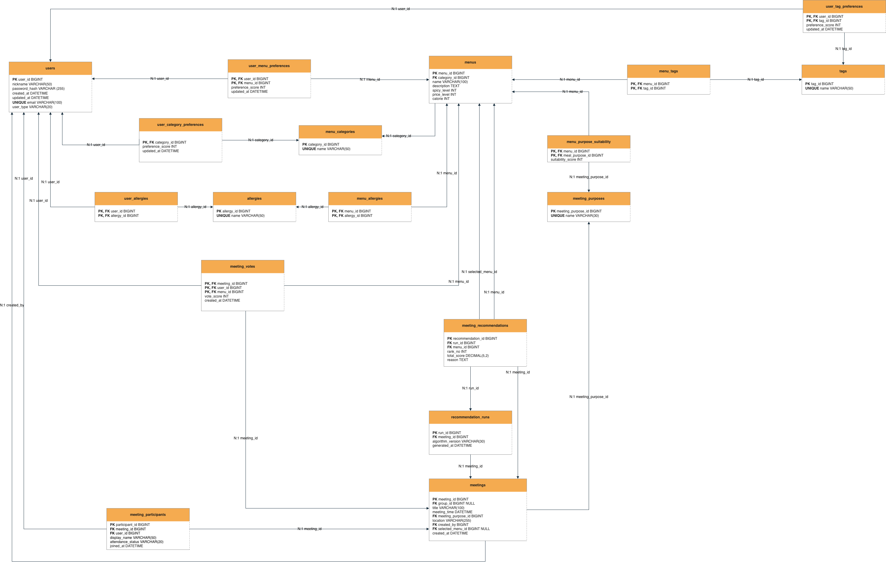

# 메뉴 결정 앱 DB 스키마 설계 개정안

## ERD 이미지



## 1. 개요

본 프로젝트는 사용자의 음식 선호도, 알러지 및 제한 조건, 최근 식사 기록, 약속 목적, 집단 참여자 정보를 기반으로 메뉴를 추천하는 앱이다.

추천 시스템은 정형화된 사용자 데이터와 메뉴 feature를 활용한 `content-based weighted ranking` 방식을 기준으로 설계한다. 


---

## 2. 테이블 목록

| 테이블명 | 설명 |
|---|---|
| `users` | 사용자 기본 정보 및 로그인에 필요한 계정 정보 |
| `menus` | 추천 대상 메뉴 정보 |
| `menu_categories` | 메뉴 카테고리 정보 |
| `tags` | 메뉴 특성 태그 정보 |
| `category_tags` | 카테고리와 태그의 다대다 관계 |
| `menu_tags` | 메뉴와 태그의 다대다 관계 |
| `user_menu_preferences` | 사용자별 메뉴 선호도 |
| `user_category_preferences` | 사용자별 카테고리 선호도 |
| `user_tag_preferences` | 사용자별 태그 선호도 |
| `allergies` | 알러지 또는 식단 제한 조건 종류 |
| `user_allergies` | 사용자별 알러지 및 제한 조건 |
| `menu_allergies` | 메뉴에 포함된 알러지 유발 성분 또는 제한 조건 |
| `meeting_purposes` | 약속 목적 정보 |
| `menu_purpose_suitability` | 메뉴별 약속 목적 적합도 |
| `meal_history` | 사용자 식사 기록 |
| `meetings` | 메뉴 추천이 필요한 약속 정보 |
| `meeting_participants` | 약속 참여자 정보 |
| `recommendation_runs` | 추천 실행 로그 |
| `meeting_recommendations` | 추천 실행별 메뉴 추천 결과 |

---

## 3. 테이블 상세 설계

### 3.1 `users`

사용자 기본 정보와 계정 정보를 저장하는 테이블이다.

| Attribute | Type | Key | Null | 설명 |
|---|---|---|---|---|
| `user_id` | `BIGINT` | PK | NOT NULL | 사용자 고유 ID |
| `email` | `VARCHAR(100)` | UNIQUE | NOT NULL | 로그인 이메일 |
| `password_hash` | `VARCHAR(255)` |  | NOT NULL | 해싱된 비밀번호 |
| `nickname` | `VARCHAR(50)` |  | NOT NULL | 사용자 닉네임 |
| `user_type` | `VARCHAR(20)` |  | NULL | 사용자 유형. 예: `STUDENT`, `WORKER`, `OTHER` |
| `created_at` | `DATETIME` |  | NOT NULL | 가입 일시 |
| `updated_at` | `DATETIME` |  | NOT NULL | 사용자 정보 수정 일시 |

비고:

- 외부 인증 서비스(Firebase Auth, Supabase Auth 등)를 사용한다면 `password_hash`는 앱 DB에 저장하지 않을 수 있다.
- 로그인 상태 자체는 DB의 `is_logged_in` 같은 컬럼으로 관리하지 않고, 세션 또는 JWT 토큰으로 관리한다.

---

### 3.2 `menu_categories`

메뉴의 대분류를 저장하는 테이블이다.

| Attribute | Type | Key | Null | 설명 |
|---|---|---|---|---|
| `category_id` | `BIGINT` | PK | NOT NULL | 카테고리 고유 ID |
| `name` | `VARCHAR(50)` | UNIQUE | NOT NULL | 카테고리 이름 |

기본 마스터 목록: 한식, 중식, 양식, 일식, 아시안, 고기, 패스트푸드

---

### 3.3 `menus`

추천 대상이 되는 메뉴 정보를 저장하는 테이블이다.

| Attribute | Type | Key | Null | 설명 |
|---|---|---|---|---|
| `menu_id` | `BIGINT` | PK | NOT NULL | 메뉴 고유 ID |
| `category_id` | `BIGINT` | FK | NOT NULL | 메뉴 카테고리 ID |
| `name` | `VARCHAR(100)` |  | NOT NULL | 메뉴 이름 |
| `description` | `TEXT` |  | NULL | 메뉴 설명 |
| `spicy_level` | `INT` |  | NOT NULL | 매운맛 정도. 0~5 |
| `price_level` | `INT` |  | NULL | 가격대. 1~5 |
| `calorie` | `INT` |  | NULL | 칼로리 |

관계:

- `menus.category_id` → `menu_categories.category_id`

---

### 3.4 `tags`

메뉴의 특성을 표현하는 태그를 저장하는 테이블이다.

| Attribute | Type | Key | Null | 설명 |
|---|---|---|---|---|
| `tag_id` | `BIGINT` | PK | NOT NULL | 태그 고유 ID |
| `name` | `VARCHAR(50)` | UNIQUE | NOT NULL | 태그 이름 |

기본 마스터 목록: 구이, 국물, 조림, 찜, 삶음, 볶음, 튀김, 날것, 매운맛

---

### 3.4.1 `category_tags`

카테고리에서 사용할 수 있는 조리 방식 태그를 다대다 관계로 저장하는 테이블이다.

| Attribute | Type | Key | Null | 설명 |
|---|---|---|---|---|
| `category_id` | `BIGINT` | PK, FK | NOT NULL | 카테고리 ID |
| `tag_id` | `BIGINT` | PK, FK | NOT NULL | 태그 ID |

복합 기본키: (`category_id`, `tag_id`)

관계:

- `category_tags.category_id` → `menu_categories.category_id`
- `category_tags.tag_id` → `tags.tag_id`

활용 예시:

- 한식 카테고리 선택 시 구이, 국물, 조림, 찜, 삶음, 볶음, 튀김, 날것, 매운맛 태그를 선택지로 제공한다.
- 패스트푸드 카테고리 선택 시 구이, 볶음, 튀김, 매운맛 태그를 선택지로 제공한다.

---

### 3.5 `menu_tags`

메뉴와 태그의 다대다 관계를 저장하는 테이블이다.

| Attribute | Type | Key | Null | 설명 |
|---|---|---|---|---|
| `menu_id` | `BIGINT` | PK, FK | NOT NULL | 메뉴 ID |
| `tag_id` | `BIGINT` | PK, FK | NOT NULL | 태그 ID |

복합 기본키: (`menu_id`, `tag_id`)

관계:

- `menu_tags.menu_id` → `menus.menu_id`
- `menu_tags.tag_id` → `tags.tag_id`

---

### 3.6 `user_menu_preferences`

사용자가 특정 메뉴를 얼마나 선호하는지 저장하는 테이블이다.

| Attribute | Type | Key | Null | 설명 |
|---|---|---|---|---|
| `user_id` | `BIGINT` | PK, FK | NOT NULL | 사용자 ID |
| `menu_id` | `BIGINT` | PK, FK | NOT NULL | 메뉴 ID |
| `preference_score` | `INT` |  | NOT NULL | 메뉴 선호도 점수. -5~5 |
| `updated_at` | `DATETIME` |  | NOT NULL | 선호도 갱신 일시 |

복합 기본키: (`user_id`, `menu_id`)

관계:

- `user_menu_preferences.user_id` → `users.user_id`
- `user_menu_preferences.menu_id` → `menus.menu_id`

점수 기준:

| 점수 | 의미 |
|---:|---|
| 5 | 매우 선호 |
| 3 | 선호 |
| 0 | 중립 |
| -3 | 비선호 |
| -5 | 강한 비선호 |

---

### 3.7 `user_category_preferences`

사용자가 특정 음식 카테고리를 얼마나 선호하는지 저장하는 테이블이다.

| Attribute | Type | Key | Null | 설명 |
|---|---|---|---|---|
| `user_id` | `BIGINT` | PK, FK | NOT NULL | 사용자 ID |
| `category_id` | `BIGINT` | PK, FK | NOT NULL | 카테고리 ID |
| `preference_score` | `INT` |  | NOT NULL | 카테고리 선호도 점수. -5~5 |
| `updated_at` | `DATETIME` |  | NOT NULL | 선호도 갱신 일시 |

복합 기본키: (`user_id`, `category_id`)

관계:

- `user_category_preferences.user_id` → `users.user_id`
- `user_category_preferences.category_id` → `menu_categories.category_id`

---

### 3.8 `user_tag_preferences`

사용자가 특정 음식 특성을 얼마나 선호하는지 저장하는 테이블이다.

| Attribute | Type | Key | Null | 설명 |
|---|---|---|---|---|
| `user_id` | `BIGINT` | PK, FK | NOT NULL | 사용자 ID |
| `tag_id` | `BIGINT` | PK, FK | NOT NULL | 태그 ID |
| `preference_score` | `INT` |  | NOT NULL | 태그 선호도 점수. -5~5 |
| `updated_at` | `DATETIME` |  | NOT NULL | 선호도 갱신 일시 |

복합 기본키: (`user_id`, `tag_id`)

관계:

- `user_tag_preferences.user_id` → `users.user_id`
- `user_tag_preferences.tag_id` → `tags.tag_id`

---

### 3.9 `allergies`

알러지 또는 식단 제한 조건 종류를 저장하는 테이블이다.

| Attribute | Type | Key | Null | 설명 |
|---|---|---|---|---|
| `allergy_id` | `BIGINT` | PK | NOT NULL | 알러지 또는 제한 조건 ID |
| `name` | `VARCHAR(50)` | UNIQUE | NOT NULL | 알러지 또는 제한 조건 이름 |

기본 마스터 목록:

- 알류
- 우유
- 메밀
- 땅콩
- 대두
- 밀
- 잣
- 호두
- 게
- 새우
- 오징어
- 고등어
- 조개류
- 복숭아
- 토마토
- 닭고기
- 돼지고기
- 쇠고기
- 아황산류

---

### 3.10 `user_allergies`

사용자가 가진 알러지 또는 제한 조건을 저장하는 테이블이다.

| Attribute | Type | Key | Null | 설명 |
|---|---|---|---|---|
| `user_id` | `BIGINT` | PK, FK | NOT NULL | 사용자 ID |
| `allergy_id` | `BIGINT` | PK, FK | NOT NULL | 알러지 또는 제한 조건 ID |

복합 기본키: (`user_id`, `allergy_id`)

관계:

- `user_allergies.user_id` → `users.user_id`
- `user_allergies.allergy_id` → `allergies.allergy_id`

---

### 3.11 `menu_allergies`

메뉴에 포함된 알러지 유발 성분 또는 제한 조건을 저장하는 테이블이다.

| Attribute | Type | Key | Null | 설명 |
|---|---|---|---|---|
| `menu_id` | `BIGINT` | PK, FK | NOT NULL | 메뉴 ID |
| `allergy_id` | `BIGINT` | PK, FK | NOT NULL | 알러지 또는 제한 조건 ID |

복합 기본키: (`menu_id`, `allergy_id`)

관계:

- `menu_allergies.menu_id` → `menus.menu_id`
- `menu_allergies.allergy_id` → `allergies.allergy_id`

추천 시 사용 방식:

- 참여자의 알러지 또는 제한 조건과 메뉴의 성분 정보가 겹치면 해당 메뉴는 추천 후보에서 제외한다.

---

### 3.12 `meeting_purposes`

약속 또는 식사의 목적을 저장하는 테이블이다.
이번 설계에서는 시간대가 아니라 목적을 기준으로 메뉴 적합도를 계산한다.

| Attribute | Type | Key | Null | 설명 |
|---|---|---|---|---|
| `meeting_purpose_id` | `BIGINT` | PK | NOT NULL | 약속 목적 ID |
| `name` | `VARCHAR(30)` | UNIQUE | NOT NULL | 약속 목적 이름 |

예시: 가벼운 식사, 든든한 식사, 회식, 데이트, 팀플 식사, 새로운 메뉴 시도, 건강식

---

### 3.13 `menu_purpose_suitability`

특정 메뉴가 특정 약속 목적에 얼마나 적합한지 저장하는 테이블이다.

| Attribute | Type | Key | Null | 설명 |
|---|---|---|---|---|
| `menu_id` | `BIGINT` | PK, FK | NOT NULL | 메뉴 ID |
| `meeting_purpose_id` | `BIGINT` | PK, FK | NOT NULL | 약속 목적 ID |
| `suitability_score` | `INT` |  | NOT NULL | 목적 적합도 점수. 0~5 |

복합 기본키: (`menu_id`, `meeting_purpose_id`)

관계:

- `menu_purpose_suitability.menu_id` → `menus.menu_id`
- `menu_purpose_suitability.meeting_purpose_id` → `meeting_purposes.meeting_purpose_id`

비고:

- `suitability_score = 0`이면 해당 약속 목적에는 부적합한 메뉴로 간주하고 추천 후보에서 제외한다.
- `suitability_score = 1~5`인 메뉴만 후보에 남기며, 점수가 높을수록 추천 점수에 더 크게 반영한다.
- ERD에 `meal_purpose_id`라는 이름이 남아 있다면 `meeting_purpose_id`로 통일하는 것이 좋다.

---

### 3.14 `meal_history`

사용자가 과거에 먹은 메뉴 기록을 저장하는 테이블이다.

| Attribute | Type | Key | Null | 설명 |
|---|---|---|---|---|
| `history_id` | `BIGINT` | PK | NOT NULL | 식사 기록 ID |
| `user_id` | `BIGINT` | FK | NOT NULL | 사용자 ID |
| `menu_id` | `BIGINT` | FK | NOT NULL | 메뉴 ID |
| `eaten_at` | `DATETIME` |  | NOT NULL | 식사 일시 |
| `rating` | `INT` |  | NULL | 식사 후 만족도. 1~5 |
| `memo` | `TEXT` |  | NULL | 식사 메모 |

관계:

- `meal_history.user_id` → `users.user_id`
- `meal_history.menu_id` → `menus.menu_id`

활용 예시:

- 최근에 먹은 메뉴 감점
- 자주 먹은 카테고리 감점
- 평점이 높은 메뉴와 유사한 태그 가산점

---

### 3.15 `meetings`

메뉴 추천이 필요한 약속 정보를 저장하는 테이블이다.
MVP에서는 반복 그룹 기능을 제외하므로 `group_id`는 사용하지 않는다.

| Attribute | Type | Key | Null | 설명 |
|---|---|---|---|---|
| `meeting_id` | `BIGINT` | PK | NOT NULL | 약속 ID |
| `title` | `VARCHAR(100)` |  | NULL | 약속 제목 |
| `meeting_time` | `DATETIME` |  | NOT NULL | 약속 날짜 및 시간 |
| `meeting_purpose_id` | `BIGINT` | FK | NOT NULL | 약속 목적 ID |
| `location` | `VARCHAR(255)` |  | NULL | 약속 장소 |
| `created_by` | `BIGINT` | FK | NOT NULL | 약속 생성자 ID |
| `selected_menu_id` | `BIGINT` | FK | NULL | 최종 선택된 메뉴 ID |
| `status` | `VARCHAR(20)` |  | NOT NULL | 약속 진행 상태 |
| `created_at` | `DATETIME` |  | NOT NULL | 약속 생성 일시 |

관계:

- `meetings.meeting_purpose_id` → `meeting_purposes.meeting_purpose_id`
- `meetings.created_by` → `users.user_id`
- `meetings.selected_menu_id` → `menus.menu_id`

`status` 예시:

- `CREATED`
- `COLLECTING`
- `RECOMMENDED`
- `DECIDED`

---

### 3.16 `meeting_participants`

약속에 참여하는 사람 정보를 저장하는 테이블이다.
가입 사용자뿐 아니라 초대 링크로 들어온 게스트도 처리할 수 있도록 `participant_id`를 기본키로 사용한다.

| Attribute | Type | Key | Null | 설명 |
|---|---|---|---|---|
| `participant_id` | `BIGINT` | PK | NOT NULL | 약속 참여자 고유 ID |
| `meeting_id` | `BIGINT` | FK | NOT NULL | 약속 ID |
| `user_id` | `BIGINT` | FK | NULL | 가입 사용자 ID. 게스트 참여자는 NULL |
| `display_name` | `VARCHAR(50)` |  | NOT NULL | 화면에 표시할 참여자 이름 |
| `attendance_status` | `VARCHAR(20)` |  | NOT NULL | 참여 상태 |
| `joined_at` | `DATETIME` |  | NULL | 약속 참여 응답 일시 |

관계:

- `meeting_participants.meeting_id` → `meetings.meeting_id`
- `meeting_participants.user_id` → `users.user_id`

`attendance_status` 예시:

- `JOINED`
- `PENDING`
- `DECLINED`

추천 시 사용 방식:

- 일반적으로 `attendance_status = 'JOINED'`인 참여자만 추천 계산에 반영한다.

---

### 3.17 `recommendation_runs`

추천이 실행된 시점과 알고리즘 버전을 저장하는 로그 테이블이다.
같은 약속에서도 조건 변경 후 추천을 다시 실행할 수 있으므로 추천 실행 단위를 분리한다.

| Attribute | Type | Key | Null | 설명 |
|---|---|---|---|---|
| `run_id` | `BIGINT` | PK | NOT NULL | 추천 실행 ID |
| `meeting_id` | `BIGINT` | FK | NOT NULL | 약속 ID |
| `algorithm_version` | `VARCHAR(30)` |  | NOT NULL | 추천 알고리즘 버전 |
| `config_json` | `JSONB` |  | NULL | 추천 실행 당시 사용한 가중치 및 필터 설정 스냅샷 |
| `generated_at` | `DATETIME` |  | NOT NULL | 추천 생성 일시 |

관계:

- `recommendation_runs.meeting_id` → `meetings.meeting_id`

---

### 3.18 `meeting_recommendations`

추천 실행별 메뉴 추천 결과를 저장하는 테이블이다.
`run_id`를 통해 약속 정보와 연결되므로 `meeting_id`를 중복 저장하지 않는다.

| Attribute | Type | Key | Null | 설명 |
|---|---|---|---|---|
| `recommendation_id` | `BIGINT` | PK | NOT NULL | 추천 결과 ID |
| `run_id` | `BIGINT` | FK | NOT NULL | 추천 실행 ID |
| `menu_id` | `BIGINT` | FK | NOT NULL | 추천 메뉴 ID |
| `rank_no` | `INT` |  | NOT NULL | 추천 순위 |
| `total_score` | `DECIMAL(5,2)` |  | NOT NULL | 최종 추천 점수 |
| `reason` | `TEXT` |  | NULL | 추천 이유 |

권장 제약:

- `UNIQUE(run_id, rank_no)`
- `UNIQUE(run_id, menu_id)`

관계:

- `meeting_recommendations.run_id` → `recommendation_runs.run_id`
- `meeting_recommendations.menu_id` → `menus.menu_id`

예시 추천 결과:

| rank_no | menu | total_score | reason |
|---:|---|---:|---|
| 1 | 샤브샤브 | 87.50 | 참여자 대부분 선호, 회식 목적에 적합, 알러지 충돌 없음 |
| 2 | 파스타 | 81.00 | 호불호가 낮고 가벼운 모임에 적합 |
| 3 | 국밥 | 73.50 | 선호도는 높지만 최근 식사 기록과 일부 중복 |

---

## 4. 주요 관계 정리

### 4.1 사용자 관련 관계

- `users` 1 : N `meal_history`
- `users` N : M `menus` through `user_menu_preferences`
- `users` N : M `menu_categories` through `user_category_preferences`
- `users` N : M `tags` through `user_tag_preferences`
- `users` N : M `allergies` through `user_allergies`
- `users` 1 : N `meetings` through `meetings.created_by`
- `users` 1 : N `meeting_participants`

### 4.2 메뉴 관련 관계

- `menu_categories` 1 : N `menus`
- `menu_categories` N : M `tags` through `category_tags`
- `menus` N : M `tags` through `menu_tags`
- `menus` N : M `allergies` through `menu_allergies`
- `menus` N : M `meeting_purposes` through `menu_purpose_suitability`
- `menus` 1 : N `meal_history`
- `menus` 1 : N `meeting_recommendations`
- `menus` 1 : N `meetings` through `meetings.selected_menu_id`

### 4.3 약속 및 추천 관련 관계

- `meetings` N : 1 `meeting_purposes`
- `meetings` 1 : N `meeting_participants`
- `meetings` 1 : N `recommendation_runs`
- `recommendation_runs` 1 : N `meeting_recommendations`

---

## 5. 추천 로직에서의 데이터 사용 방식

### 5.1 후보 메뉴 필터링

먼저 추천 불가능하거나 적합하지 않은 메뉴를 제거 또는 감점한다.

1. 참여자의 알러지 및 제한 조건과 충돌하는 메뉴 제외
2. 강한 비선호 메뉴 제외 또는 감점
3. 약속 목적 적합도 `suitability_score = 0`인 메뉴 제외
4. 최근 식사 기록과 중복되는 메뉴 감점

### 5.2 개인별 메뉴 점수 계산

각 사용자에 대해 메뉴별 점수를 계산한다.

```text
personal_score =
  메뉴 선호도 * 0.5
+ 카테고리 선호도 * 0.3
+ 태그 선호도 * 0.2
+ 약속 목적 적합도
- 최근 식사 중복 패널티
- 강한 비선호 패널티
```

사용되는 테이블:

- `user_menu_preferences`
- `user_category_preferences`
- `user_tag_preferences`
- `menu_purpose_suitability`
- `meal_history`

### 5.3 집단 추천 점수 계산

참여자들의 개인 점수를 종합하여 집단 점수를 계산한다.

```text
group_score =
  average_score * 0.7
+ minimum_score * 0.3
- strong_dislike_penalty
- recent_duplicate_penalty
```

단순 평균만 사용하면 한 명이 매우 싫어하는 메뉴가 추천될 수 있으므로, 최소 점수 또는 강한 비선호 패널티를 함께 고려한다.

기본 추천 설정값은 다음과 같다.

```json
{
  "menuPreference": 0.5,
  "categoryPreference": 0.3,
  "tagPreference": 0.2,
  "purposeSuitabilityRule": "exclude_if_score_zero",
  "averageScore": 0.7,
  "minimumScore": 0.3,
  "strongDislikePenalty": 20,
  "strongDislikeScore": -3,
  "recentDuplicateDays": 3,
  "resultLimit": 3
}
```

최근 식사 중복 패널티는 `recentDuplicateDays = n`, 최근 동일 메뉴를 먹은 시점이 `k`일 전일 때 다음 방식으로 계산한다.

```text
recent_duplicate_penalty = 3 - (3k / n)
score -= recent_duplicate_penalty
```

따라서 오늘 먹은 메뉴는 `3`점 감점되고, `n`일 전에 먹은 메뉴는 `0`점에 가까워진다.

### 5.4 추천 결과 저장

추천을 실행하면 먼저 `recommendation_runs`에 실행 로그와 `config_json` 설정값 스냅샷을 저장하고, 메뉴별 랭킹 결과는 `meeting_recommendations`에 저장한다.

최종 선택된 메뉴가 있으면 `meetings.selected_menu_id`에 저장한다.

---

## 6. MVP 기준 필수 테이블

```text
users
menus
menu_categories
tags
category_tags
menu_tags
user_menu_preferences
user_category_preferences
user_tag_preferences
allergies
user_allergies
menu_allergies
meeting_purposes
menu_purpose_suitability
meal_history
meetings
meeting_participants
recommendation_runs
meeting_recommendations
```

---


## 7. 설계 요약

본 스키마는 메뉴 추천에 필요한 데이터를 문자열 중심이 아니라 정형 데이터 중심으로 저장한다.
메뉴 이름, 설명, 장소와 같은 정보는 `VARCHAR` 또는 `TEXT`로 저장하지만, 추천 계산에 직접 사용되는 선호도, 매운맛, 가격대, 목적 적합도 등은 `INT` 또는 `DECIMAL` 형태로 수치화한다.

개정안에서는 MVP 구현 범위를 고려해 반복 그룹, 시간대 추천, 투표 기능을 제외하고 약속방 중심 구조로 단순화했다.
또한 게스트 참여자를 처리하기 위해 `meeting_participants`에 `participant_id`를 도입했고, 추천 결과는 `recommendation_runs`와 `meeting_recommendations`로 분리하여 같은 약속에서 추천을 여러 번 실행하더라도 결과를 구분할 수 있도록 설계했다.

이를 통해 개인 추천뿐만 아니라 집단 약속 상황에서도 메뉴별 점수를 계산하고, 최종적으로 랭킹 형태의 추천 결과와 추천 이유를 제공할 수 있다.
